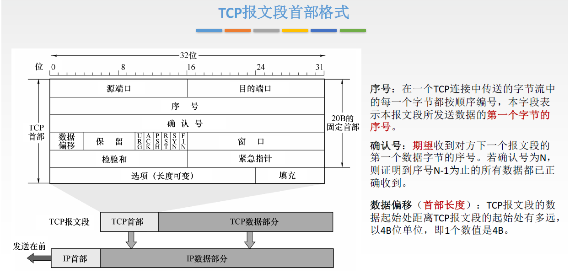
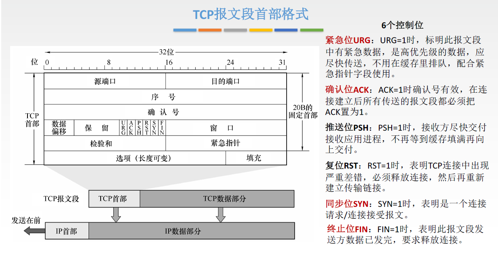
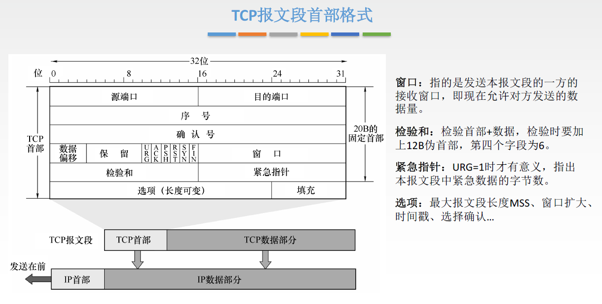

1. 以前使用telnet的时候, 经常是输入字符但是它不显示, 感觉输入无效. 今天看自顶向下, 才知道原来在telnet(基于TCP)客户端上, 用户输入了一个字符, 将会被传输到服务端, 然后服务端返回这个字符它才会回显. 而不是像ssh那样都会显示. 在linux下开一个`nc -l 6666`就可以测试. 

2. *RTT*(Round-Trip Time)，往返时延: 报文发出到收到确认之间的时间.

3. 超时重传会一直重传吗? 

     不会. 一定的次数尝试之后就会停止. 

    快重传: 指的是如果接收到了1 + 3次同一个ACK, 那么会触发快重传.

    这里的快重传是相对超时重传的, 普通的超时重传为通过指数增长的超时时间计时来决定是否重传. 

4. 定时器的作用? 

    有很多种定时器

    1. 连接建立定时器: 建立连接时如果长时间没有响应, 将会以指数增长的时间重传尝试重连.
    2. 超时重传的定时器
    3. 延迟确认定时器: 延迟ACK的发送
    4. 坚持定时器(persist timer): 接收窗口为0时, 会定时地发送0字节探测包
    5. keepaliver timer: 当tcp两端长时间不发送数据时, 如何判断连接是否失效呢? 使用该定时器
    6. FIN_WAIT_2定时器: 防止对方一直不发送FIN包
    7. TIME_WAIT定时器

5. 防止SYN洪泛攻击(SYN flood attack)(SYN半连接): SYN cookie. 

6. 流量控制: 如果主机B的接收缓存满了, 接收窗口为0, 那么主机A将会继续发送一个字节数据的报文段(使用定时器, 发送心跳包). 因为如果不发送, 那么如果B的程序清空缓存, 它不会发送ack, A不会直到有接收空间了. 

7. nagle算法与延时确认的冲突: nagle算法只允许同时存在一个已发送但未确认的小包(小于MSS), 之后的小包会试图合并. 而延迟确认指的是当接收方接收到数据想要发送ACK的时候, 会延迟一段时间(比如40ms), 如果这段时间内有数据需要发送, 那么会一起发送. nagle和延时确认在这种特殊情况下, 会导致网络的延迟过高.

    nagle算法是时代的产物, 它是为了避免网络上有过多的小包而降低吞吐量. 现在很多程序都没有开启nagle算法, 因为现在的设施已经比以前好多了, 而无法接收过高的延迟. 

    nagle算法的描述如下

    ```
    	if there is new data to send #有数据要发送
            # 发送窗口缓冲区和队列数据 >=mss，队列数据（available data）为原有的队列数据加上新到来的数据
            # 也就是说缓冲区数据超过mss大小，nagle算法尽可能发送足够大的数据包
            if the window size >= MSS and available data is >= MSS 
                send complete MSS segment now # 立即发送
            else
                if there is unconfirmed data still in the pipe # 前一次发送的包没有收到ack
                    # 将该包数据放入队列中，直到收到一个ack再发送缓冲区数据
                    enqueue data in the buffer until an acknowledge is received 
                else
                    send data immediately # 立即发送
                end if
            end if
        end if　
    ```

    即

    ```
    Nagle算法的实现规则：
    如果包长度达到MSS，则允许发送；
    如果该包含有FIN，则允许发送；
    设置了TCP_NODELAY选项，则允许发送；
    未设置TCP_CORK选项时，若所有发出去的小数据包（包长度小于MSS）均被确认，则允许发送；
    上述条件都未满足，但发生了超时（一般为200ms），则立即发送。
    ```

8. TIME_WAIT状态

    为什么TIME_WAIT状态要等待两个MSL(max segment lifetime)? 

    有两个原因:

    1. 防止发送的ACK没有到达服务端, 因此需要等待两个MSL
    2. 如果立刻断开连接, 接下来又马上使用这个端口, 可能会出现上一个连接遗留下来的数据包. (不是有序列号来区分吗? 还是说怕存在序列号刚好相同的情况?)

    TIME_WAIT会带来什么问题?

    如果客户端频繁地使用短连接, 比如redis短连接, 那么客户端会有大量的连接处于TIME_WAIT状态. 这也是为什么要有连接池的一个原因: 连接池避免了大量短连接的存在. 

    但是如果在一个处于TIME_WAIT状态的端口上建立连接, 会发生什么? 那就相当于没有TIME_WAIT了, 

    一个TCP选项: 当开启 **net.ipv4.tcp_tw_reuse** 选项时，处于 TIME_WAIT 状态的连接可以被重用. 原理是比较数据包时间戳.

    还有个更激进的选项: tcp_tw_recyle , 系统会缓存每台主机（即 IP）连接过来的最新的时间戳。这样在NAT的情况下会出现问题. 因为NAT的出口IP是公共的, 造成其他主机的时间戳影响当前连接.
    
9. NAT（Network Address Translator）的出现是为了缓解 IP 地址耗尽的临时方案. NAT 设备负责维护局域网私有 IP 地址和端口到外网 IP 和端口的映射规则。
   
   优点:
   
   - 出口 IP 共享：通过一个公网地址可以让许多机器连上网络，解决 IP 地址不够用的问题
   - 安全隐私防护：实际的机器可以隐藏自己真实的 IP 地址 当然也有明显的弊端：NAT 会对包进行修改，有些协议无法通过 NAT。
   
10. 为什么要有3次握手呢? 2次或4次可以嘛?

11. 为什么要有4次挥手呢? 3次可以嘛?

12. 接收窗口是什么? 代表字节的大小嘛? 接收窗口的字节数包括tcp首部嘛?

     代表字节数. 

13. 重传的机制是什么? 超时重传, 快重传, 冗余ACK

14. 停等协议是什么

     停等协议的接收、发送双方仅需设置一个帧的缓冲存储空间和帧序号只取0或1的两个状态标志位，便可有效地实现数据重发并确保接收方接受的数据不会重复。

     信道利用率低

15. tcp首部各部分含义

     

     

     

16. 为什么ACK(第三次握手)不消耗序列号? 为什么SYN消耗序列号?

     FIN之所以消耗序列号, 是因为他需要ACK. 如果不消耗序列号, 那么ACK的确认值不变, 就意味着和上一个数据包的值一样, 会混淆

     需要确认的包就需要消耗序列号, 不需要确认的就不需要

     > SYNs and FINs require acknowledgement, thus they increment the stream's sequence number by one when used. 
     >
     > For example, if the connection is closed without sending any more data, then if the
     > FIN did *not* consume a sequence
     > number the closing end couldn't tell the difference between an ACK for the FIN,
     > and an ACK for the data that was sent prior to the FIN.

17. 阻塞IO和非阻塞IO

